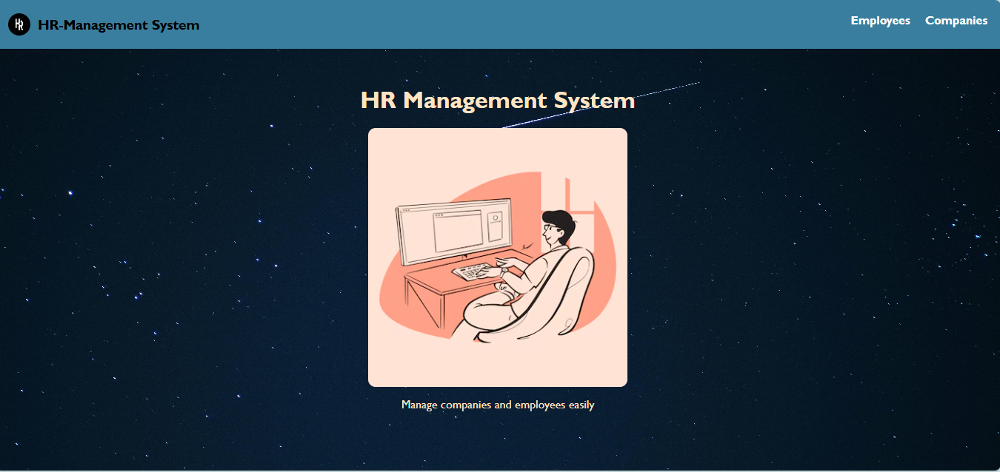
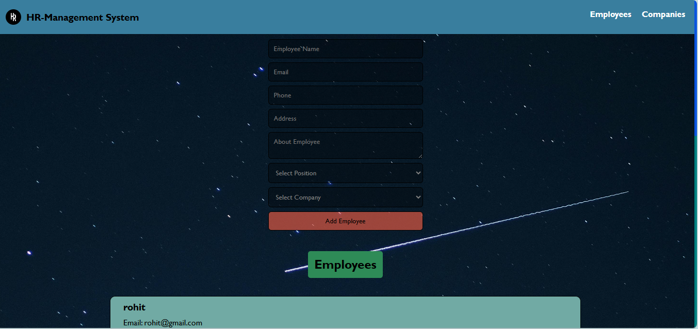
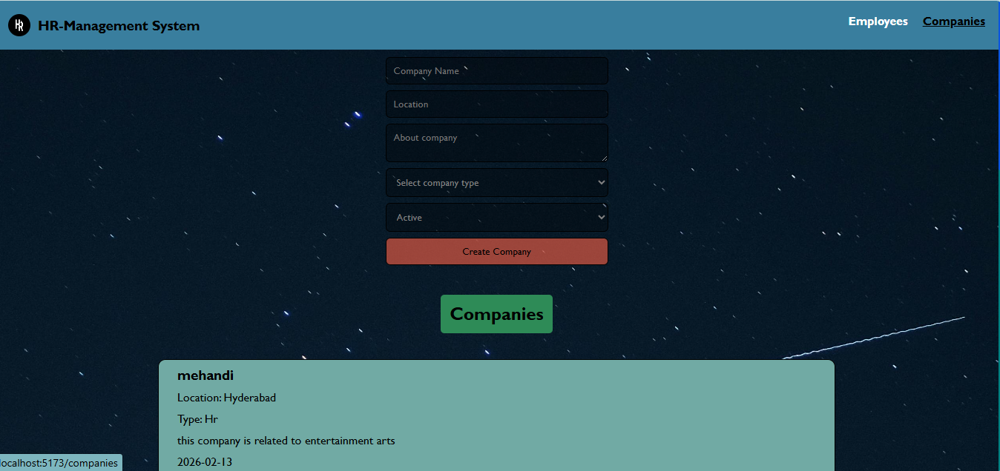
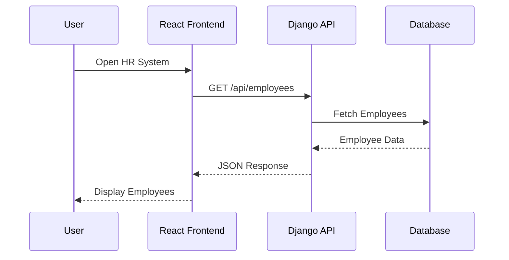

# HR Management System

[](https://hr-management-sistem.netlify.app/)
[](https://company-employee-drf-api.onrender.com/)

A full-stack **HR Management System** built using **React and Django REST Framework** that allows users to manage companies and employees through a clean and responsive interface.

The application demonstrates **full-stack development, REST API integration, and cloud deployment** with the frontend hosted on **Netlify** and the backend on **Render**.

---


---

# Live Demo

**Frontend (Netlify)**
[https://hr-management-sistem.netlify.app/](https://hr-management-sistem.netlify.app/)

**Backend API (Render)**
[https://company-employee-drf-api.onrender.com/](https://company-employee-drf-api.onrender.com/)

---

## Table of Contents

* [Live Demo](#live-demo)
* [Features](#features)
* [Tech Stack](#tech-stack)
* [API Endpoints](#api-endpoints)
* [Companies API](#companies-api)
* [Employees API](#employees-api)
* [Project Structure](#project-structure)
* [Installation](#installation)
* [Clone Repository](#clone-repository)
* [Backend Setup](#backend-setup)
* [Frontend Setup](#frontend-setup)
* [Screenshots](#screenshots)
* [Future Improvements](#future-improvements)
* [Author](#author)

---

# Features

* Create and manage companies
* Add employees and assign them to companies
* View employee and company lists
* Dynamic position input with trending positions
* Responsive mobile navigation with burger menu
* REST API communication between React and Django
* Cloud deployment (Netlify + Render)

---

# Tech Stack

## Frontend

* HTML
* CSS
* JavaScript
* React
* React Router

## Backend

* Python
* Django
* Django REST Framework

## Deployment

* Netlify (Frontend)
* Render (Backend)

---

# API Endpoints

## Companies API

| Method | Endpoint                                                                                                                       | Description            |
| ------ | ------------------------------------------------------------------------------------------------------------------------------ | ---------------------- |
| GET    | [https://company-employee-drf-api.onrender.com/api/companies](https://company-employee-drf-api.onrender.com/api/companies)     | Get all companies      |
| GET    | [https://company-employee-drf-api.onrender.com/api/companies/1](https://company-employee-drf-api.onrender.com/api/companies/1) | Get a specific company |

---

## Employees API

| Method | Endpoint                                                                                                                       | Description             |
| ------ | ------------------------------------------------------------------------------------------------------------------------------ | ----------------------- |
| GET    | [https://company-employee-drf-api.onrender.com/api/employees](https://company-employee-drf-api.onrender.com/api/employees)     | Get all employees       |
| GET    | [https://company-employee-drf-api.onrender.com/api/employees/1](https://company-employee-drf-api.onrender.com/api/employees/1) | Get a specific employee |

---

## Screenshots

### Home Page


### Employees Page


### Companies Page


### Mobile View

---

# Project Structure

```
company-employee-drf-api
│
├── backend (Django REST API)
│
├── company-frontend
│   ├── src
│   │   ├── components
│   │   ├── services
│   │   └── pages
│   │
│   ├── index.html
│   ├── main.jsx
│   └── App.jsx
│
└── requirements.txt
```

---
## System Architecture

```mermaid
graph TD
A[User Browser] --> B[React Frontend - Netlify]
B --> C[Django REST API - Render]
C --> D[Database]
---

```
---

---

# 2️⃣ API Communication Flow

```markdown
## API Communication Flow



---

# 3️⃣ Deployment Architecture

```markdown
## Deployment Architecture

```mermaid
graph LR
A[User] --> B[Netlify - React Frontend]
B --> C[Render - Django API]
C --> D[Database]
---

```
---
## Application Flow

```mermaid
flowchart TD

A[User Opens Website] --> B[React Frontend - Netlify]

B --> C[Employee Page]
B --> D[Company Page]

C --> E[GET /api/employees]
D --> F[GET /api/companies]

E --> G[Django REST API - Render]
F --> G

G --> H[Database]

H --> G
G --> B

B --> I[Display Data to User]
---
```
---

# Installation

Clone the repository

```
git clone https://github.com/vruthvik-chinthoju/company-employee-drf-api.git
cd company-employee-drf-api
```

---

## Backend Setup

```
pip install -r requirements.txt
python manage.py migrate
python manage.py runserver
```

Backend runs at:

```
http://127.0.0.1:8000/
```

---

## Frontend Setup

```
cd company-frontend
npm install
npm run dev
```

Frontend runs at:

```
http://localhost:5173/
```

---

# Future Improvements

* Employee update and edit functionality
* Search and filter employees
* Authentication system
* Dashboard analytics

---

# Author

**Ruthvik Chintu**

GitHub
[https://github.com/vruthvik-chinthoju](https://github.com/vruthvik-chinthoju)

LinkedIn
[https://www.linkedin.com/in/chinthoju-vruthvik-83754b320/](https://www.linkedin.com/in/chinthoju-vruthvik-83754b320/)

---


---

⭐ If you like this project, consider giving it a **star on GitHub**.
